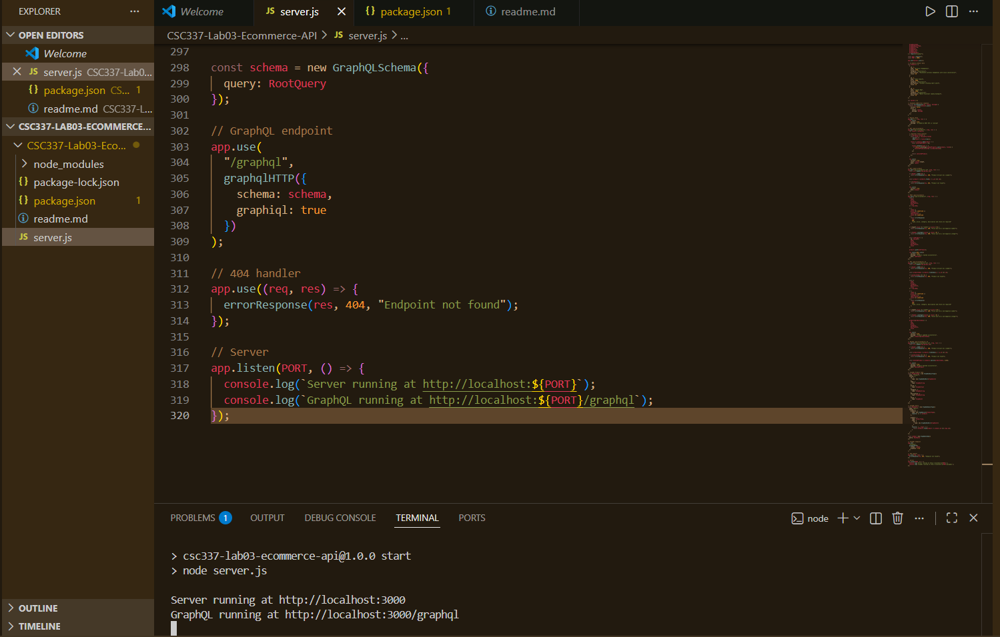
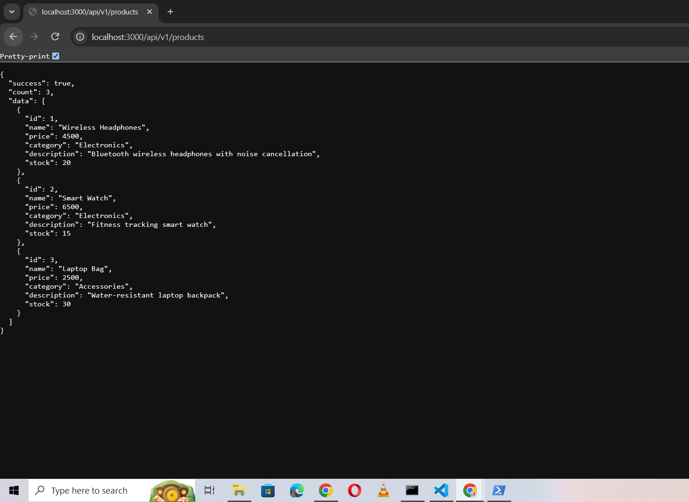
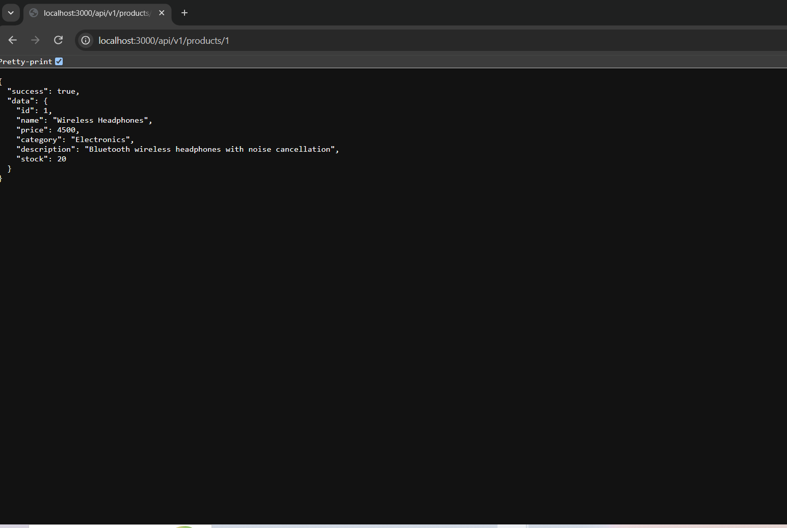
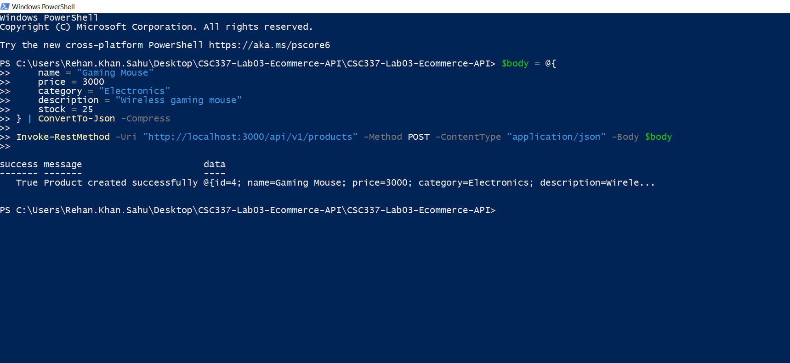
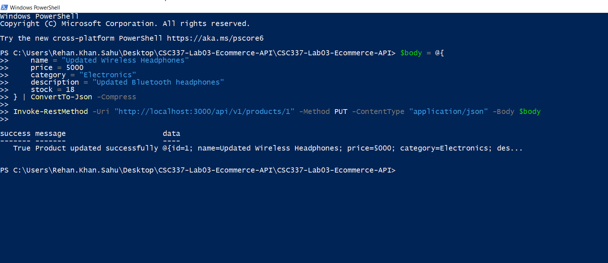
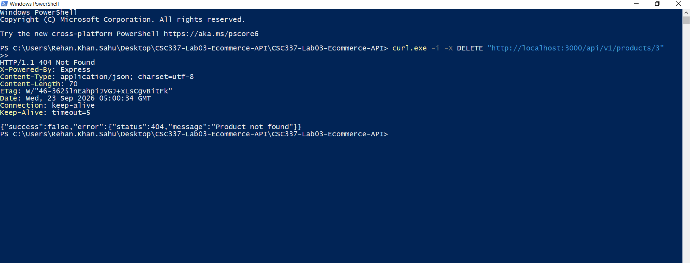
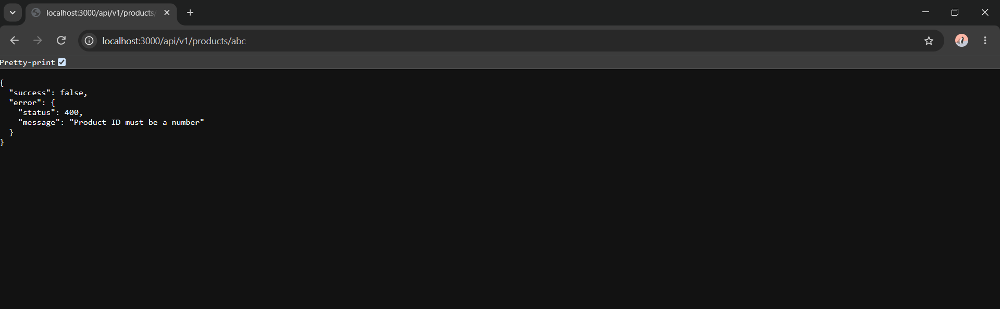
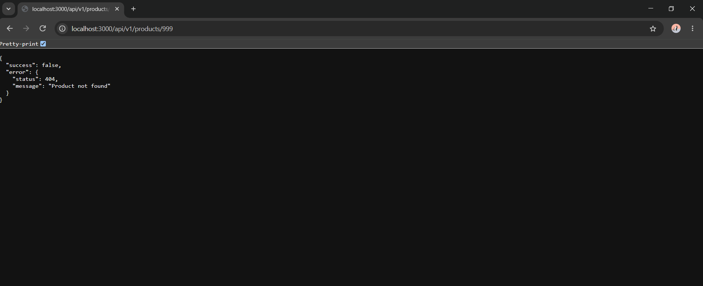
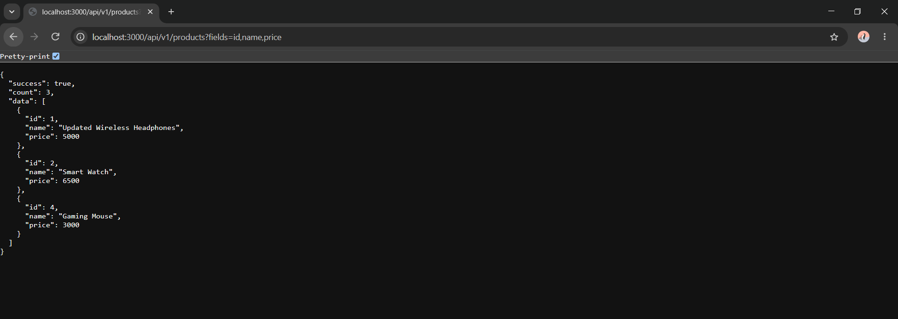
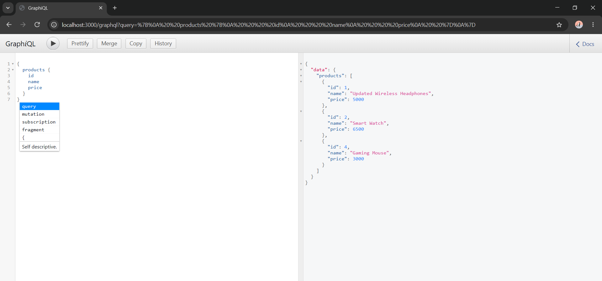

# CSC337 Lab Assignment 03

## Enterprise RESTful APIs & GraphQL

---

## Student Information

| Field                                 | Details                           |
| ------------------------------------- | --------------------------------- |
| **Student Name**                      | Muhammad Rehan                    |
| **Roll Number / Registration Number** | SP24-BSE-045                 |
| **Course**                            | CSC337 - Web Technologies         |
| **Lab Assignment**                    | Lab Assignment 03                 |
| **Project**                           | Enterprise RESTful APIs & GraphQL |

---

## 1. Project Overview

This project implements an **E-Commerce RESTful API** using **Node.js** and **Express.js**.

The API provides CRUD operations for products using the following HTTP methods:

* **GET** - Retrieve products
* **POST** - Create a new product
* **PUT** - Update an existing product
* **DELETE** - Delete a product

The project also includes:

* Standardized JSON error handling
* HTTP status codes such as **200, 201, 400, and 404**
* REST API versioning using `/api/v1`
* Field selector to reduce REST API over-fetching
* GraphQL endpoint
* GraphiQL interface for testing GraphQL queries
* Local testing of REST API endpoints
* Screenshots demonstrating the implemented functionality

---

## 2. Technologies Used

* **Node.js**
* **Express.js**
* **GraphQL**
* **express-graphql**
* **JavaScript**
* **Git & GitHub**

---

## 3. Project Structure

```text
CSC337-Lab03-Ecommerce-API/
│
├── screenshots/
│   ├── 01_Server_Running.png
│   ├── 02_GET_All_Products.png
│   ├── 03_GET_Single_Product.png
│   ├── 04_POST_Create_Product.png
│   ├── 05_PUT_Update_Product.png
│   ├── 06_DELETE_Product.png
│   ├── 07_400_Bad_Request.png
│   ├── 08_404_Product_Not_Found.png
│   ├── 09_Field_Selector.png
│   ├── 10_GraphQL_Query.png
│   └── 11_GitHub_Public_Repository.png
│
├── .gitignore
├── package.json
├── package-lock.json
├── README.md
└── server.js
```

The `screenshots` folder contains all screenshots demonstrating the implementation and testing of the project.

---

## 4. Installation

### Step 1: Clone or Download the Repository

Clone the public GitHub repository:

```bash
git clone YOUR_GITHUB_REPOSITORY_URL
```

Move into the project directory:

```bash
cd CSC337-Lab03-Ecommerce-API
```

### Step 2: Install Dependencies

Run:

```bash
npm install
```

This installs all required Node.js packages listed in `package.json`.

---

## 5. Run the Application

Start the server using:

```bash
npm start
```

The server will run at:

```text
http://localhost:3000
```

The GraphQL endpoint is available at:

```text
http://localhost:3000/graphql
```

Expected terminal output:

```text
Server running at http://localhost:3000
GraphQL running at http://localhost:3000/graphql
```

### Screenshot



---

# 6. RESTful API Endpoints

The main REST API resource is:

```text
/api/v1/products
```

The API supports the following operations:

| Method | Endpoint               | Description          |
| ------ | ---------------------- | -------------------- |
| GET    | `/api/v1/products`     | Get all products     |
| GET    | `/api/v1/products/:id` | Get a single product |
| POST   | `/api/v1/products`     | Create a product     |
| PUT    | `/api/v1/products/:id` | Update a product     |
| DELETE | `/api/v1/products/:id` | Delete a product     |

---

# 7. GET All Products

### Endpoint

```http
GET /api/v1/products
```

### Full URL

```text
http://localhost:3000/api/v1/products
```

This endpoint returns all available products.

### Example Response

```json
{
  "success": true,
  "count": 3,
  "data": [
    {
      "id": 1,
      "name": "Wireless Headphones",
      "price": 4500,
      "category": "Electronics",
      "description": "Bluetooth wireless headphones with noise cancellation",
      "stock": 20
    }
  ]
}
```

### Screenshot



---

# 8. GET Single Product

### Endpoint

```http
GET /api/v1/products/:id
```

### Example

```text
http://localhost:3000/api/v1/products/1
```

This endpoint returns a single product based on its ID.

### Screenshot



---

# 9. POST Create Product

### Endpoint

```http
POST /api/v1/products
```

This endpoint creates a new product.

### Example JSON Request

```json
{
  "name": "Gaming Mouse",
  "price": 3000,
  "category": "Electronics",
  "description": "Wireless gaming mouse",
  "stock": 25
}
```

A successfully created product returns HTTP status:

```text
201 Created
```

### Screenshot



---

# 10. PUT Update Product

### Endpoint

```http
PUT /api/v1/products/:id
```

### Example

```text
http://localhost:3000/api/v1/products/1
```

This endpoint updates an existing product.

### Example JSON Request

```json
{
  "name": "Updated Wireless Headphones",
  "price": 5000,
  "category": "Electronics",
  "description": "Updated Bluetooth headphones",
  "stock": 18
}
```

A successful update returns HTTP status:

```text
200 OK
```

### Screenshot



---

# 11. DELETE Product

### Endpoint

```http
DELETE /api/v1/products/:id
```

### Example

```text
http://localhost:3000/api/v1/products/3
```

This endpoint removes a product from the product list.

A successful deletion returns HTTP status:

```text
200 OK
```

### Screenshot



---

# 12. Error Handling

The API uses a standardized JSON structure for errors.

The standard error format is:

```json
{
  "success": false,
  "error": {
    "status": 400,
    "message": "Error message"
  }
}
```

The project handles errors such as:

* **400 Bad Request**
* **404 Not Found**

---

## 12.1 400 Bad Request

A `400 Bad Request` response is returned when an invalid product ID or invalid request data is provided.

### Example

```text
http://localhost:3000/api/v1/products/abc
```

Example response:

```json
{
  "success": false,
  "error": {
    "status": 400,
    "message": "Product ID must be a number"
  }
}
```

### Screenshot



---

## 12.2 404 Product Not Found

A `404 Not Found` response is returned when the requested product does not exist.

### Example

```text
http://localhost:3000/api/v1/products/999
```

Example response:

```json
{
  "success": false,
  "error": {
    "status": 404,
    "message": "Product not found"
  }
}
```

### Screenshot



---

# 13. Field Selector — Solving REST Over-Fetching

REST APIs can sometimes return more fields than the client actually needs. This is known as **over-fetching**.

To reduce unnecessary data, this API provides a field selector using the `fields` query parameter.

### Example

```text
http://localhost:3000/api/v1/products?fields=id,name,price
```

This requests only:

```text
id
name
price
```

instead of returning all product fields.

### Screenshot



---

# 14. GraphQL

The project also provides a GraphQL endpoint.

### GraphQL URL

```text
http://localhost:3000/graphql
```

GraphQL allows the client to request only the fields it needs.

## Example Query

```graphql
{
  products {
    id
    name
    price
  }
}
```

The response contains only the requested fields.

### Screenshot



---

# 15. GraphQL Single Product Query

A single product can also be requested using its ID.

### Example Query

```graphql
{
  product(id: 1) {
    id
    name
    price
    category
  }
}
```

This returns the selected fields of product ID `1`.

---

# 16. HTTP Status Codes Used

| Status Code | Meaning     | Usage                                 |
| ----------- | ----------- | ------------------------------------- |
| **200**     | OK          | Successful GET, PUT and DELETE        |
| **201**     | Created     | Successfully created product          |
| **400**     | Bad Request | Invalid request or invalid product ID |
| **404**     | Not Found   | Product or endpoint not found         |

---

# 17. API Versioning

The REST API uses versioning:

```text
/api/v1/products
```

Here:

* `/api` identifies the API
* `/v1` represents version 1
* `/products` represents the product resource

API versioning makes it possible to introduce future API versions without breaking existing clients.

---

# 18. Testing

The following functionality was tested locally:

* GET all products
* GET single product
* POST product
* PUT product
* DELETE product
* 400 Bad Request
* 404 Product Not Found
* Field selector
* GraphQL query

The testing screenshots are included in the `screenshots` folder.

---

# 19. Screenshots

## 19.1 Server Running


## 19.2 GET All Products


## 19.3 GET Single Product


## 19.4 POST Create Product


## 19.5 PUT Update Product


## 19.6 DELETE Product


## 19.7 400 Bad Request


## 19.8 404 Product Not Found


## 19.9 Field Selector


## 19.10 GraphQL Query


# 20. GitHub Repository

The complete source code, README documentation and screenshots are available in the public GitHub repository.

**Repository:**

```text
YOUR_GITHUB_REPOSITORY_URL
```

The repository contains:

* `server.js`
* `package.json`
* `package-lock.json`
* `.gitignore`
* `README.md`
* `screenshots/`


# 21. Conclusion

This project demonstrates the implementation of an E-Commerce RESTful API using Node.js and Express.js.

The API supports complete CRUD operations, standardized JSON error handling, API versioning, field selection for reducing over-fetching, and GraphQL queries for requesting specific data fields.

The project was tested locally and documented with screenshots.
